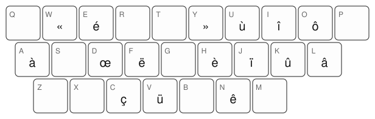

# Accentoshka

A custom French keyboard layout for macOS: plain US QWERTY, plus one Option chord per accented
character — hence the name, in the family of [APToshka](https://github.com/didedoshka/APToshka).

The small corner letter is the plain QWERTY key; the big legend is what Option + that key types. Keys without a big legend have no Option character. Capitals: Option+Shift on the same key
(É Ç À È …).

## Why

Typing French on a US layout means dead keys or press-and-hold — both slow. qwerty-fr places accents
by keyboard geometry, which breaks down on a non-QWERTY 36-key board. Accentoshka places them by *letter
identity*: every chord is a rule about letters, so it works unchanged on any physical layout that
types the same letters.

## The rules

- **Main accent of a letter = Option + that letter**: ⌥e é, ⌥a à, ⌥o ô, ⌥i î, ⌥u ù, ⌥c ç.
- **The four frequent exceptions** (hosts chosen by measurement, see below): ⌥h è, ⌥n ê, ⌥l â, ⌥k û.
- **Diaeresis = the next letter of the alphabet**: ⌥f ë, ⌥j ï, ⌥v ü.
- **œ is « e dans l'o »**: ⌥d œ.
- **Mirrored guillemets**: ⌥w «, ⌥y ».

Everything else — letters, digits, punctuation — is untouched US QWERTY.

The è/ê/â/û hosts were not hand-picked: every (accent × free key) pair was measured with
[keyboard_layout_optimizer](https://github.com/dariogoetz/keyboard_layout_optimizer) and
[oxeylyzer](https://github.com/O-X-E-Y/oxeylyzer) on a modern French news corpus, and the winning
assignment beat every hand-made candidate.

## Installation (macOS)

Copy `Accentoshka.bundle` to `~/Library/Keyboard Layouts/`, log out and back in, then add **Accentoshka** in
System Settings → Keyboard → Input Sources (it is listed under French).

On a laptop, remap Caps Lock to Option (System Settings → Keyboard → Keyboard Shortcuts → Modifier
Keys) to keep the chords on the home row.

Known hazard: Google Docs/Sheets intercept some Option chords (notably ⌥w). The
[devnoname120 userscript](https://github.com/devnoname120/qwerty-fr-userscript) is the workaround.

## Regenerating the image

`python3 draw-layout.py` reads `Accentoshka.bundle/Contents/Resources/Accentoshka.keylayout` and rewrites
`accentoshka.svg`.

## See also

I use this layout alongside [Yasherty](https://github.com/didedoshka/yasherty) (Russian) and
[APToshka](https://github.com/didedoshka/APToshka), my 36-key keymap.
